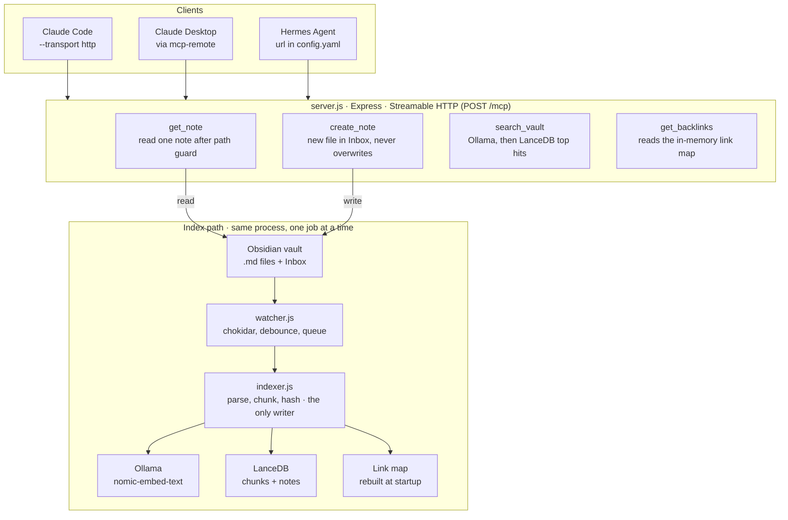

# Obsidian Vault MCP — Build Guide

_Last updated: 4 October 2026_

## Rundown

You'll build one long-running Node process that indexes an Obsidian vault into LanceDB and serves four MCP tools over Streamable HTTP. Claude and Hermes both connect to that one process, so there is only ever one watcher and one writer.

There are ten steps. Each ends with something that runs and a checkpoint, and each teaches one concept. Don't skip ahead: the early steps are cheap and make the later ones obvious.

### The four tools

| Tool | Input | Returns | Built in |
| --- | --- | --- | --- |
| `get_note` | `path` | Full note text and frontmatter | Step 2 |
| `search_vault` | `query`, `limit?`, `folder?` | Top matching sections: path, heading, snippet, score | Step 6 |
| `get_backlinks` | `path` | Notes linking to it, with the linking line | Step 7 |
| `create_note` | `title`, `content`, `tags?` | Path of the new note in the inbox | Step 9 |

### Project layout

```
vault-mcp/
  package.json        "type": "module"
  .env                VAULT_PATH, INBOX_DIR, OLLAMA_URL, DB_PATH, PORT
  src/
    config.js         reads env, exports constants
    raw-server.js     Step 1 only (throwaway, no SDK)
    server.js         Express + MCP SDK, registers tools
    vault.js          path guard, read and write files
    frontmatter.js    YAML frontmatter parse and stringify
    parse.js          frontmatter, links, tags, chunks
    embed.js          Ollama calls
    store.js          LanceDB tables and queries
    indexer.js        indexFile, removeFile, fullReindex, reconcile
    links.js          link resolution and backlink map
    watcher.js        chokidar + debounce + queue
  scripts/
    parse-all.js      Step 3 checkpoint
    embed-test.js     Step 4 experiment
    query.js          Step 5 checkpoint
```

### How the pieces fit

The watcher and the tools never touch LanceDB directly. They both go through the indexer and the store, which keeps writes in one place.



A note created by `create_note` is just a new file, so the watcher indexes it like any edit made in Obsidian.

## Step 0 — Setup (15 min)

**Goal:** a project that runs, a small test vault, and an embedding model answering on localhost.

1. Check Node is 20 or newer: `node -v`. Shell commands in this guide come in two flavours: **PowerShell** for Windows and **bash/zsh** for macOS and Linux. The Node code is the same on all three.
2. Create the project.

   ```powershell
   # Windows (PowerShell)
   mkdir vault-mcp; cd vault-mcp
   npm init -y
   npm pkg set type=module
   mkdir src, scripts
   ```

   ```bash
   # macOS / Linux
   mkdir -p vault-mcp/src vault-mcp/scripts && cd vault-mcp
   npm init -y
   npm pkg set type=module
   ```
3. Make a throwaway test vault (not your real one yet). Create 6–10 notes with a few `# headings`, some `[[wikilinks]]` between them, a couple of `#tags`, and one note with YAML frontmatter. Put two notes in a subfolder.
4. Pull the model and confirm it answers.

   ```powershell
   # Windows (PowerShell): should print 768
   ollama pull nomic-embed-text
   (Invoke-RestMethod -Uri http://localhost:11434/api/embed -Method Post -ContentType "application/json" -Body '{"model":"nomic-embed-text","input":"hello"}').embeddings[0].Count
   ```

   ```bash
   # macOS / Linux: should print the start of {"model":...,"embeddings":[[...
   ollama pull nomic-embed-text
   curl -s localhost:11434/api/embed -d '{"model":"nomic-embed-text","input":"hello"}' | head -c 200
   ```

   On Windows, don't use `curl` with single-quoted JSON: cmd and PowerShell pass the quotes through, and Ollama replies `invalid character '\''`.
5. Create `.env` and `../src/config.js`. Run with `node --env-file=.env src/...` so you need no dotenv package. Keep exactly one `VAULT_PATH` line, for your OS. On Windows, forward slashes work and avoid escaping issues.

   ```bash
   # .env
   # Windows:      VAULT_PATH=C:/Users/you/test-vault
   # macOS:        VAULT_PATH=/Users/you/test-vault
   # Linux:        VAULT_PATH=/home/you/test-vault
   VAULT_PATH=C:/Users/you/test-vault
   INBOX_DIR=Inbox
   OLLAMA_URL=http://127.0.0.1:11434
   DB_PATH=./data/lancedb
   PORT=3000
   ```

   ```js
   // src/config.js
   import path from "node:path";
   export const VAULT = path.resolve(process.env.VAULT_PATH);
   export const INBOX = process.env.INBOX_DIR ?? "Inbox";
   export const OLLAMA_URL = process.env.OLLAMA_URL ?? "http://127.0.0.1:11434";
   export const DB_PATH = process.env.DB_PATH ?? "./data/lancedb";
   export const PORT = Number(process.env.PORT ?? 3000);
   ```

**Paths on Windows, macOS and Linux.** One rule keeps the code portable: inside the program, a note's path is always vault-relative with forward slashes (`Projects/Idea.md`), on every OS. That's what gets stored in LanceDB and the link map. Conversion happens only at the edges, with three helpers in `../src/vault.js` (Step 2):

- `normRel()` cleans paths coming in from tools: backslashes become `/`, a leading `..` is dropped.
- `toRel()` turns OS paths from the filesystem and the watcher into the stored form.
- `resolveInVault()` turns a stored path into a real OS path for reading or writing, and refuses anything outside the vault.

Node's `fs` accepts forward slashes on Windows, so `${VAULT}/${rel}` in the indexer works everywhere too. Windows and (by default) macOS also treat `idea.md` and `Idea.md` as the same file; Linux doesn't. The backlink lookup compares case-insensitively so it behaves the same on all three.

**Checkpoint:** `node --env-file=.env -e "import('./src/config.js').then(c => console.log(c.VAULT))"` prints your vault path.

- [ ] Step 0 done

## Step 1 — Raw MCP over HTTP, no SDK (45 min)

**Goal:** see the protocol with nothing hiding it. One POST endpoint, plain JSON-RPC in and out, driven by hand from your shell.

**What to know first**

- Every message is JSON-RPC 2.0: requests have an `id` and expect a reply; notifications have no `id` and get none.
- Over Streamable HTTP, the client POSTs each message to one URL (`/mcp`). A request gets back either JSON or an SSE stream. A notification gets `202 Accepted` with an empty body.
- The session starts with `initialize`, then the client sends `notifications/initialized`, then real work.

**Build `../src/raw-server.js`** using only `node:http`:

```js
import http from "node:http";

const TOOLS = [{
  name: "ping",
  description: "Health check. Returns pong.",
  inputSchema: { type: "object", properties: {} },
}];

function handle({ id, method, params }) {
  switch (method) {
    case "initialize":
      return { result: {
        protocolVersion: params.protocolVersion,
        capabilities: { tools: {} },
        serverInfo: { name: "vault-raw", version: "0.0.1" },
      }};
    case "tools/list":
      return { result: { tools: TOOLS } };
    case "tools/call":
      if (params.name === "ping")
        return { result: { content: [{ type: "text", text: "pong" }] } };
      return { result: { isError: true, content: [{ type: "text", text: `Unknown tool ${params.name}` }] } };
    default:
      return { error: { code: -32601, message: "Method not found" } };
  }
}

http.createServer((req, res) => {
  if (req.url !== "/mcp" || req.method !== "POST") return res.writeHead(405).end();
  let body = "";
  req.on("data", (c) => (body += c));
  req.on("end", () => {
    let msg;
    try { msg = JSON.parse(body); }
    catch { return res.writeHead(400).end(JSON.stringify({ jsonrpc: "2.0", id: null, error: { code: -32700, message: "Parse error" } })); }
    if (msg.id === undefined) return res.writeHead(202).end(); // notification
    res.writeHead(200, { "Content-Type": "application/json" });
    res.end(JSON.stringify({ jsonrpc: "2.0", id: msg.id, ...handle(msg) }));
  });
}).listen(3000, "127.0.0.1", () => console.error("raw MCP on :3000"));
```

**Drive it by hand** (run `node src/raw-server.js` in one terminal):

```powershell
# Helper: POST a JSON-RPC message and pretty-print the reply
function mcp($body) {
  Invoke-RestMethod -Uri http://127.0.0.1:3000/mcp -Method Post -ContentType "application/json" `
    -Headers @{ Accept = "application/json, text/event-stream" } -Body $body | ConvertTo-Json -Depth 10
}

mcp '{"jsonrpc":"2.0","id":1,"method":"initialize","params":{"protocolVersion":"2025-06-18","capabilities":{},"clientInfo":{"name":"ps","version":"1"}}}'

# A notification returns no body, so check the status code instead (expect 202)
(Invoke-WebRequest -Uri http://127.0.0.1:3000/mcp -Method Post -ContentType "application/json" -Body '{"jsonrpc":"2.0","method":"notifications/initialized"}').StatusCode

mcp '{"jsonrpc":"2.0","id":2,"method":"tools/list"}'
mcp '{"jsonrpc":"2.0","id":3,"method":"tools/call","params":{"name":"ping","arguments":{}}}'
```

In PowerShell, errors like the broken-JSON test surface as exceptions. Read the response body in the exception message to see the JSON-RPC error.

On macOS or Linux, the same calls with `curl`:

```bash
mcp() {
  curl -s http://127.0.0.1:3000/mcp -H 'Content-Type: application/json' \
    -H 'Accept: application/json, text/event-stream' -d "$1"; echo
}

mcp '{"jsonrpc":"2.0","id":1,"method":"initialize","params":{"protocolVersion":"2025-06-18","capabilities":{},"clientInfo":{"name":"sh","version":"1"}}}'

# A notification returns no body, so print the status code instead (expect 202)
curl -s -o /dev/null -w '%{http_code}\n' http://127.0.0.1:3000/mcp -H 'Content-Type: application/json' \
  -d '{"jsonrpc":"2.0","method":"notifications/initialized"}'

mcp '{"jsonrpc":"2.0","id":2,"method":"tools/list"}'
mcp '{"jsonrpc":"2.0","id":3,"method":"tools/call","params":{"name":"ping","arguments":{}}}'
```

**Exercises**

- Add an `echo` tool that takes `{ text: string }` and returns it. Update its `inputSchema`.
- Send an unknown method and a broken JSON body. Read the two different errors.
- Call an unknown tool. Notice it's a successful response with `isError: true`, not a protocol error. The model sees tool errors; protocol errors are for the client.

**What this skips** (the SDK handles it next step): session IDs (`Mcp-Session-Id`), SSE streaming, the `MCP-Protocol-Version` header, `Origin` checks, and input validation.

**Checkpoint:** all four calls return what you expect, and you can explain each one.

- [ ] Step 1 done

## Step 2 — SDK server and get\_note (1 hr)

**Goal:** the real server skeleton with one real tool, and the path guard every file tool will share.

```powershell
npm i @modelcontextprotocol/sdk zod express yaml
```

This guide originally used `gray-matter` for frontmatter. It was replaced with `yaml` because of CVE-2026-78847: gray-matter's built-in JavaScript engine runs a `---js` frontmatter block through `eval()`, so any note dropped into the vault could execute code in your always-on daemon. Obsidian frontmatter is always YAML, so a small parser of your own is all you need.

**`../src/vault.js`** — the path guard. Every path a tool receives is untrusted input from a model.

```js
import fs from "node:fs/promises";
import path from "node:path";
import { VAULT } from "./config.js";
import { parseFrontmatter } from "./frontmatter.js";

// Paths inside the program: vault-relative, forward slashes, on every OS
export const normRel = (p) =>
  String(p).trim().replace(/\\/g, "/").replace(/^(\.\/)+/, "").replace(/\/{2,}/g, "/");

// Stored path -> real OS path, refusing anything outside the vault
export function resolveInVault(rel) {
  const abs = path.resolve(VAULT, ...normRel(rel).split("/"));
  const inside = path.relative(VAULT, abs);
  if (inside === ".." || inside.startsWith(".." + path.sep) || path.isAbsolute(inside))
    throw new Error("Path outside vault");
  return abs;
}

// Real OS path (from fs or the watcher) -> stored path
export const toRel = (abs) => path.relative(VAULT, abs).split(path.sep).join("/");

export async function readNote(rel) {
  const r = normRel(rel);
  const raw = await fs.readFile(resolveInVault(r), "utf8");
  const { data, content } = parseFrontmatter(raw);
  return { path: r, frontmatter: data, content };
}
```

The guard uses `path.relative` instead of comparing string prefixes. That also catches a path on another Windows drive (`D:\secret.md`), where the relative path comes back absolute.

**`../src/frontmatter.js`** — split a note into YAML data and body, and write it back. Only a plain `---` line opens frontmatter, so `---js` is never treated as code; it's just text.

```js
import YAML from "yaml";

// Optional BOM, "---", the YAML lines, closing "---"
const FM = /^?---\r?\n([\s\S]*?\r?\n)?---[ \t]*(?:\r?\n|$)/;

export function parseFrontmatter(raw) {
  const m = raw.match(FM);
  if (!m) return { data: {}, content: raw };
  let data = {};
  try {
    const parsed = YAML.parse(m[1] ?? "");
    if (parsed && typeof parsed === "object" && !Array.isArray(parsed)) data = parsed;
  } catch {
    // Malformed YAML: keep the body, treat frontmatter as empty
  }
  return { data, content: raw.slice(m[0].length) };
}

export function stringifyFrontmatter(body, data) {
  return `---\n${YAML.stringify(data)}---\n\n${body}`;
}
```

**Prove the fix:** create a note starting with `---js`, a `console.log("pwned")` line, and a closing `---`. Call `get_note` on it. Nothing should print in the server window, and the note should come back with empty frontmatter and those lines as plain text.

**`../src/server.js`** — stateless Streamable HTTP. A fresh `McpServer` per request is the SDK's documented stateless pattern.

```js
import express from "express";
import { z } from "zod";
import { McpServer } from "@modelcontextprotocol/sdk/server/mcp.js";
import { StreamableHTTPServerTransport } from "@modelcontextprotocol/sdk/server/streamableHttp.js";
import { PORT } from "./config.js";
import { readNote } from "./vault.js";

const text = (t) => ({ content: [{ type: "text", text: t }] });
const fail = (t) => ({ ...text(t), isError: true });

function buildServer() {
  const server = new McpServer({ name: "vault", version: "0.1.0" });

  server.registerTool("get_note", {
    description: "Read one Obsidian note by its vault-relative path, e.g. 'Projects/Idea.md'.",
    inputSchema: { path: z.string().describe("Vault-relative path ending in .md") },
    annotations: { readOnlyHint: true },
  }, async ({ path }) => {
    try {
      const n = await readNote(path);
      return text(`# ${n.path}\n\nFrontmatter: ${JSON.stringify(n.frontmatter)}\n\n${n.content}`);
    } catch (e) {
      return fail(`Could not read ${path}: ${e.message}`);
    }
  });

  return server;
}

const app = express();
app.use(express.json({ limit: "2mb" }));

// Reject browser pages from other origins (DNS-rebinding protection)
app.use((req, res, next) => {
  const o = req.headers.origin;
  if (o && !/^https?:\/\/(localhost|127\.0\.0\.1)(:\d+)?$/.test(o)) return res.status(403).end();
  next();
});

app.post("/mcp", async (req, res) => {
  const server = buildServer();
  const transport = new StreamableHTTPServerTransport({ sessionIdGenerator: undefined });
  res.on("close", () => { transport.close(); server.close(); });
  await server.connect(transport);
  await transport.handleRequest(req, res, req.body);
});

app.get("/health", (_req, res) => res.json({ ok: true }));
app.listen(PORT, "127.0.0.1", () => console.error(`vault MCP on :${PORT}/mcp`));
```

**Test with the Inspector:** run `node --env-file=.env src/server.js`, then `npx @modelcontextprotocol/inspector`. In its UI pick **Streamable HTTP**, URL `http://127.0.0.1:3000/mcp`, connect, and call `get_note`.

**Try to break it:** call `get_note` with `../../etc/passwd`, an absolute path, and a file that doesn't exist. All three should return `isError`, and the server should stay up.

**Concepts:** zod gives you validation plus the JSON Schema the client sees. `annotations.readOnlyHint` tells clients the tool changes nothing. Re-run your PowerShell calls from Step 1 against this server and compare the responses.

**If the SDK API differs:** older examples use `server.tool(name, schema, handler)`. Check the README for the version in your `../package.json`.

- [ ] Step 2 done

## Step 3 — Parsing notes (1–1.5 hr)

**Goal:** turn a note into structured data: frontmatter, outgoing links, tags, and heading-based chunks. No MCP in this step, just a script.

**Why chunk by heading:** search should land on the section that answers, not a 3,000-word note. Chunk quality matters more to search results than the embedding model does.

**`../src/parse.js`**

````js
import fs from "node:fs/promises";
import path from "node:path";
import crypto from "node:crypto";
import { parseFrontmatter } from "./frontmatter.js";

const SKIP = /(^|\/)\.(obsidian|trash|git)(\/|$)/;

export async function listNotes(root) {
  const all = await fs.readdir(root, { recursive: true });
  return all.map((p) => p.split(path.sep).join("/"))
    .filter((p) => p.endsWith(".md") && !SKIP.test(p));
}

export const hashOf = (s) => crypto.createHash("sha1").update(s).digest("hex");

const LINK = /\[\[([^\]|#]+)(?:#[^\]|]*)?(?:\|[^\]]*)?\]\]/g;
const TAG = /(?:^|\s)#([\p{L}\p{N}_\/-]+)/gu;

export function parseNote(rel, raw) {
  const { data, content } = parseFrontmatter(raw);
  const title = path.basename(rel, ".md");
  const links = [...content.matchAll(LINK)].map((m) => m[1].trim());
  const fmTags = [].concat(data.tags ?? []).map(String);
  const tags = [...new Set([...fmTags, ...[...content.matchAll(TAG)].map((m) => m[1])])];
  return { path: rel, title, frontmatter: data, links, tags, chunks: chunk(title, content) };
}

const MAX = 1500; // characters per chunk, tune later

function chunk(title, body) {
  const out = [];
  let heading = "", buf = [], inFence = false;
  const flush = () => {
    const t = buf.join("\n").trim();
    if (t) for (const piece of split(t)) out.push({ heading, text: piece });
    buf = [];
  };
  for (const line of body.split("\n")) {
    if (line.startsWith("```")) inFence = !inFence;
    const h = !inFence && line.match(/^(#{1,6})\s+(.*)/);
    if (h) { flush(); heading = h[2].trim(); continue; }
    buf.push(line);
  }
  flush();
  // Prefix context so a chunk still makes sense on its own
  return out.map((c, i) => ({ ...c, idx: i, embedText: `${title}${c.heading ? " > " + c.heading : ""}\n\n${c.text}` }));
}

function split(text) {
  if (text.length <= MAX) return [text];
  const parts = [], paras = text.split(/\n\s*\n/);
  let cur = "";
  for (const p of paras) {
    if (cur && cur.length + p.length > MAX) { parts.push(cur); cur = ""; }
    cur += (cur ? "\n\n" : "") + p;
  }
  if (cur) parts.push(cur);
  return parts;
}
````

**`../scripts/parse-all.js`** — prints what the parser sees:

```js
import fs from "node:fs/promises";
import { VAULT } from "../src/config.js";
import { listNotes, parseNote } from "../src/parse.js";

for (const rel of await listNotes(VAULT)) {
  const n = parseNote(rel, await fs.readFile(`${VAULT}/${rel}`, "utf8"));
  console.log(`${rel}  links=${n.links.length} tags=${n.tags.join(",")} chunks=${n.chunks.length}`);
  for (const c of n.chunks) console.log(`   [${c.heading || "(top)"}] ${c.text.slice(0, 60).replace(/\n/g, " ")}`);
}
```

**Exercises**

- Add a note with a code block containing `# not a heading`. Confirm it isn't treated as one.
- Add `[[Note#Section|alias]]`. Confirm the link resolves to `Note`.
- Write a 5,000-character section and watch it split.

**Known simplifications:** the tag regex also matches `#` inside URLs and code; links inside code blocks are counted. Fine for now, worth fixing later.

**Checkpoint:** the script prints sensible links, tags and chunks for every test note.

- [ ] Step 3 done

## Step 4 — Embeddings (45 min)

**Goal:** understand what a vector is and why similar meaning gives nearby vectors, before any database gets involved.

**`../src/embed.js`**

```js
import { OLLAMA_URL } from "./config.js";

const MODEL = "nomic-embed-text";

async function embed(inputs) {
  const r = await fetch(`${OLLAMA_URL}/api/embed`, {
    method: "POST",
    headers: { "Content-Type": "application/json" },
    body: JSON.stringify({ model: MODEL, input: inputs }),
  });
  if (!r.ok) throw new Error(`Ollama ${r.status}: ${await r.text()}`);
  return (await r.json()).embeddings; // one array of numbers per input
}

// nomic-embed-text was trained with task prefixes. Leaving them out hurts retrieval.
export const embedDocs = (texts) => embed(texts.map((t) => `search_document: ${t}`));
export const embedQuery = async (q) => (await embed([`search_query: ${q}`]))[0];
```

**`scripts/embed-test.js`** — run with `node --env-file=.env scripts/embed-test.js`:

```js
import { embedDocs, embedQuery } from "../src/embed.js";

const cos = (a, b) => {
  let d = 0, na = 0, nb = 0;
  for (let i = 0; i < a.length; i++) { d += a[i] * b[i]; na += a[i] ** 2; nb += b[i] ** 2; }
  return d / Math.sqrt(na * nb);
};

const docs = [
  "How to reset a customer's ERP password",
  "Steps for unlocking a locked user account",
  "Recipe for nasi goreng with fried egg",
  "Notes on LanceDB vector indexes",
];
const dv = await embedDocs(docs);
console.log("dimensions:", dv[0].length);

const qv = await embedQuery("user can't log in");
docs.map((d, i) => [cos(qv, dv[i]).toFixed(3), d])
  .sort((a, b) => b[0] - a[0])
  .forEach(([s, d]) => console.log(s, d));
```

**What to observe**

- The vector length (expect 768). Every chunk becomes one point in that space.
- The two account-related sentences score highest even though they share almost no words with the query. That's semantic search.
- Remove the prefixes and run again. Compare the scores.
- Time a batch of 50 versus 50 single calls. Batching is why `embedDocs` takes an array.

**Concept:** search is just "embed the query, find the stored vectors closest to it". Everything in Steps 5 and 6 is plumbing around this one idea.

**Checkpoint:** you can explain why the ranking came out the way it did.

- [ ] Step 4 done

## Step 5 — LanceDB storage and search (1.5 hr)

**Goal:** persist every chunk with its vector and query it from a script. Still no MCP.

```bash
npm i @lancedb/lancedb
```

**Two tables**

| Table | One row per | Columns | Used for |
| --- | --- | --- | --- |
| `chunks` | chunk | `id`, `path`, `heading`, `text`, `vector` | search |
| `notes` | note | `path`, `hash`, `mtime` | knowing what changed (Step 8) |

**`../src/store.js`**

```js
import * as lancedb from "@lancedb/lancedb";
import { DB_PATH } from "./config.js";

const db = await lancedb.connect(DB_PATH);
const q = (s) => `'${String(s).replace(/'/g, "''")}'`; // escape for SQL filters

async function open(name) {
  return (await db.tableNames()).includes(name) ? db.openTable(name) : null;
}

// Replace a table's rows for one path; create the table on first use
// (the schema is inferred from the first rows)
async function replaceRows(name, path, rows) {
  const t = await open(name);
  if (!t) { if (rows.length) await db.createTable(name, rows); return; }
  await t.delete(`path = ${q(path)}`);
  if (rows.length) await t.add(rows);
}

export async function replaceNote(meta, chunkRows) {
  await replaceRows("chunks", meta.path, chunkRows);
  await replaceRows("notes", meta.path, [meta]);
}

export async function removeNote(path) {
  for (const name of ["chunks", "notes"]) {
    const t = await open(name);
    if (t) await t.delete(`path = ${q(path)}`);
  }
}

export async function search(vector, { limit = 5, folder } = {}) {
  const t = await open("chunks");
  if (!t) return [];
  let s = t.vectorSearch(vector).distanceType("cosine").limit(limit);
  if (folder) s = s.where(`path LIKE ${q(folder.replace(/\/$/, "") + "/%")}`);
  return s.toArray();
}

export async function allNoteMeta() {
  const t = await open("notes");
  return t ? t.query().select(["path", "hash", "mtime"]).toArray() : [];
}
```

Reindexing a note is always delete-by-path, then add: a note's chunk count changes between edits, so updating rows in place would leave stale chunks behind.

**`../src/indexer.js`** — the only code that writes to the store:

```js
import fs from "node:fs/promises";
import { VAULT } from "./config.js";
import { listNotes, parseNote, hashOf } from "./parse.js";
import { embedDocs } from "./embed.js";
import { replaceNote, removeNote } from "./store.js";

export async function indexFile(rel) {
  const abs = `${VAULT}/${rel}`;
  const [raw, stat] = await Promise.all([fs.readFile(abs, "utf8"), fs.stat(abs)]);
  const note = parseNote(rel, raw);
  const vectors = note.chunks.length ? await embedDocs(note.chunks.map((c) => c.embedText)) : [];
  const rows = note.chunks.map((c, i) => ({
    id: `${rel}#${c.idx}`, path: rel, heading: c.heading, text: c.text, vector: vectors[i],
  }));
  await replaceNote({ path: rel, hash: hashOf(raw), mtime: stat.mtimeMs }, rows);
  return note;
}

export { removeNote as removeFile };

export async function fullReindex() {
  const files = await listNotes(VAULT);
  for (const rel of files) { await indexFile(rel); console.error("indexed", rel); }
  return files.length;
}
```

**`../scripts/query.js`**

```js
import { fullReindex } from "../src/indexer.js";
import { embedQuery } from "../src/embed.js";
import { search } from "../src/store.js";

if (process.argv.includes("--reindex")) console.log("notes:", await fullReindex());
const query = process.argv.filter((a) => !a.startsWith("--")).slice(2).join(" ");
for (const r of await search(await embedQuery(query), { limit: 5 }))
  console.log(r._distance.toFixed(3), r.path, ">", r.heading || "(top)");
```

Run `node --env-file=.env scripts/query.js --reindex "some question"` once, then without `--reindex`.

**Concepts:** cosine distance is 1 minus similarity, so lower is better. For a vault of a few thousand notes, LanceDB's brute-force search is fast enough; you don't need an ANN index yet. The `id` column makes each chunk addressable.

**Checkpoint:** queries from the terminal return the notes you'd expect, and re-running `--reindex` doesn't duplicate rows.

- [ ] Step 5 done

## Step 6 — search\_vault tool (45 min)

**Goal:** wrap Step 5 in a tool, and learn that the description you write is how the model decides when to call it.

Add to `buildServer()` in `../src/server.js`:

```js
import { embedQuery } from "./embed.js";
import { search } from "./store.js";
import { normRel } from "./vault.js";

server.registerTool("search_vault", {
  description:
    "Semantic search over the user's Obsidian notes. Use it when the user asks about " +
    "something they may have written down. Returns matching sections with their note " +
    "path; call get_note on a path to read the whole note.",
  inputSchema: {
    query: z.string().describe("What to look for, in natural language"),
    limit: z.number().int().min(1).max(20).default(5),
    folder: z.string().optional().describe("Restrict to a vault folder, e.g. 'Projects'"),
  },
  annotations: { readOnlyHint: true },
}, async ({ query, limit, folder }) => {
  const hits = await search(await embedQuery(query), { limit: limit * 3, folder: folder && normRel(folder) });
  // Keep the best chunk per note so one long note can't fill every slot
  const seen = new Set(), best = [];
  for (const h of hits) {
    if (seen.has(h.path)) continue;
    seen.add(h.path); best.push(h);
    if (best.length === limit) break;
  }
  if (!best.length) return text("No matching notes.");
  return text(best.map((h, i) =>
    `${i + 1}. ${h.path}${h.heading ? " > " + h.heading : ""} (score ${(1 - h._distance).toFixed(2)})\n` +
    h.text.slice(0, 300).replace(/\s+/g, " ")
  ).join("\n\n"));
});
```

**Try it in a real client now.** Skip ahead to the Claude Code line in Step 10, connect, and ask a question your test vault can answer. Watch which tools it calls and in what order.

**Exercises**

- Make the description vague ("Searches notes") and see whether the model still chains `search_vault` → `get_note`.
- Return all chunks instead of one per note. Compare the answers you get.
- Ask something your vault has nothing on. Does the model admit it, or stretch weak matches? A minimum score cutoff might help.

**Checkpoint:** a client answers a question from your notes and cites the note path.

- [ ] Step 6 done

## Step 7 — Link graph and get\_backlinks (1 hr)

**Goal:** a second kind of retrieval. Vectors find notes that *mean* something similar; links find notes you *deliberately connected*.

**The hard part is resolution.** `[[Idea]]` is a name, not a path. Obsidian matches it to a file called `Idea.md` anywhere in the vault, and `[[Projects/Idea]]` narrows it by folder. When two files share a name, take the one with the shortest path. That's close to Obsidian's default behaviour and good enough here.

**`../src/links.js`** — kept in memory and rebuilt at startup. It's small and fast to rebuild.

```js
const outgoing = new Map(); // source path -> Set of link names as written
const paths = new Set();     // every note path

export function setLinks(src, linkNames) { paths.add(src); outgoing.set(src, new Set(linkNames)); }
export function dropNote(src) { paths.delete(src); outgoing.delete(src); }

export function resolve(name) {
  const want = name.toLowerCase().replace(/\.md$/, "");
  const matches = [...paths].filter((p) => {
    const noExt = p.toLowerCase().replace(/\.md$/, "");
    return noExt === want || noExt.endsWith("/" + want);
  });
  return matches.sort((a, b) => a.length - b.length)[0] ?? null;
}

export function backlinksOf(target) {
  const want = target.toLowerCase(); // same result on case-insensitive and case-sensitive filesystems
  const out = [];
  for (const [src, names] of outgoing)
    for (const n of names) if (resolve(n)?.toLowerCase() === want) { out.push(src); break; }
  return out;
}
```

**Wire it into `../src/indexer.js`.** The map lives in memory, so it is empty every time the server starts. `loadAllLinks` fills it from disk without embedding anything, and the indexer keeps it current after that. (In Step 8, `reconcile()` takes over this job and `loadAllLinks` can go.)

```js
import fs from "node:fs/promises";
import { VAULT } from "./config.js";
import { listNotes, parseNote, hashOf } from "./parse.js";
import { embedDocs } from "./embed.js";
import { replaceNote, removeNote } from "./store.js";
import { setLinks, dropNote } from "./links.js";

export async function indexFile(rel) {
  const abs = `${VAULT}/${rel}`;
  const [raw, stat] = await Promise.all([fs.readFile(abs, "utf8"), fs.stat(abs)]);
  const note = parseNote(rel, raw);
  const vectors = note.chunks.length ? await embedDocs(note.chunks.map((c) => c.embedText)) : [];
  const rows = note.chunks.map((c, i) => ({
    id: `${rel}#${c.idx}`, path: rel, heading: c.heading, text: c.text, vector: vectors[i],
  }));
  await replaceNote({ path: rel, hash: hashOf(raw), mtime: stat.mtimeMs }, rows);
  setLinks(rel, note.links);           // keep the link map current
  return note;
}

export async function removeFile(rel) {
  await removeNote(rel);
  dropNote(rel);
}

// Fill the link map at startup (parse only, no embedding)
export async function loadAllLinks() {
  const files = await listNotes(VAULT);
  for (const rel of files) {
    const raw = await fs.readFile(`${VAULT}/${rel}`, "utf8");
    setLinks(rel, parseNote(rel, raw).links);
  }
  return files.length;
}

export async function fullReindex() {
  const files = await listNotes(VAULT);
  for (const rel of files) { await indexFile(rel); console.error("indexed", rel); }
  return files.length;
}
```

**Call it in `../src/server.js`** — imports at the top, the call just before `app.listen(...)`:

```js
import { loadAllLinks } from "./indexer.js";
import { backlinksOf } from "./links.js";
import { normRel } from "./vault.js";

// ...
console.error("links loaded for", await loadAllLinks(), "notes");
app.listen(PORT, "127.0.0.1", () => console.error(`vault MCP on :${PORT}/mcp`));
```

Until Step 8 adds the watcher, restart the server after editing notes so the map picks up new links.

**The tool:**

```js
server.registerTool("get_backlinks", {
  description: "List notes that link to the given note. Use it to explore related notes the user connected on purpose.",
  inputSchema: { path: z.string().describe("Vault-relative path of the target note") },
  annotations: { readOnlyHint: true },
}, async ({ path }) => {
  const srcs = backlinksOf(normRel(path));
  return text(srcs.length ? srcs.map((s) => `- ${s}`).join("\n") : `Nothing links to ${path}.`);
});
```

**Exercises**

- `backlinksOf` resolves every link on every call: O(links × notes). Fine for a few hundred notes. Precompute an `incoming` map and compare.
- Return the line containing each link, not just the path. Now the model sees *why* they're connected.
- Add `outgoing` links to `get_note`'s output.

**Checkpoint:** backlinks for a test note match Obsidian's Backlinks panel.

- [ ] Step 7 done

## Step 8 — Watcher, incremental reindex, startup reconcile (2 hr)

**Goal:** keep the index in sync with a live vault. This is the hardest step and the most valuable thing to understand.

```bash
npm i chokidar
```

**Three problems to solve**

1. **Bursts.** Obsidian autosaves every couple of seconds while you type. Without a debounce you'd re-embed the same note dozens of times.
2. **Overlap.** Two reindexes of the same note running at once can delete each other's rows. Run index jobs one at a time through a queue.
3. **Downtime.** Edits made while the server was off produce no events. On startup, compare the vault against the `notes` table.

**`../src/watcher.js`**

```js
import chokidar from "chokidar";
import { VAULT } from "./config.js";
import { toRel } from "./vault.js";
import { indexFile, removeFile } from "./indexer.js";

const DEBOUNCE_MS = 1500;
const timers = new Map();
let chain = Promise.resolve(); // serial queue: one job at a time

const enqueue = (job) => (chain = chain.then(job).catch((e) => console.error("index error:", e.message)));

function schedule(rel, kind) {
  clearTimeout(timers.get(rel));
  timers.set(rel, setTimeout(() => {
    timers.delete(rel);
    enqueue(() => (kind === "remove" ? removeFile(rel) : indexFile(rel)));
    console.error(kind, rel);
  }, DEBOUNCE_MS));
}

export function startWatcher() {
  const ignored = (p) => /[\\/]\.(obsidian|trash|git)([\\/]|$)/.test(p);
  chokidar.watch(VAULT, { ignored, ignoreInitial: true, awaitWriteFinish: { stabilityThreshold: 300 } })
    .on("add", (p) => p.endsWith(".md") && schedule(toRel(p), "index"))
    .on("change", (p) => p.endsWith(".md") && schedule(toRel(p), "index"))
    .on("unlink", (p) => p.endsWith(".md") && schedule(toRel(p), "remove"));
}

export { enqueue };
```

A rename arrives as `unlink` + `add`, so it's handled with no extra code.

**Reconcile — add to `../src/indexer.js`:**

```js
import { allNoteMeta } from "./store.js";
import { setLinks } from "./links.js";

export async function reconcile() {
  const onDisk = await listNotes(VAULT);
  const stored = new Map((await allNoteMeta()).map((m) => [m.path, m]));
  let changed = 0;
  for (const rel of onDisk) {
    const raw = await fs.readFile(`${VAULT}/${rel}`, "utf8");
    const prev = stored.get(rel);
    if (prev && prev.hash === hashOf(raw)) setLinks(rel, parseNote(rel, raw).links); // unchanged: links only
    else { await indexFile(rel); changed++; }
    stored.delete(rel);
  }
  for (const gone of stored.keys()) { await removeFile(gone); changed++; }
  return changed;
}
```

This reads every file on startup but only re-embeds the ones whose hash changed. Embedding is the slow part; reading and hashing files is cheap by comparison.

**Wire it up** at the bottom of `../src/server.js`:

```js
import { reconcile } from "./indexer.js";
import { startWatcher, enqueue } from "./watcher.js";

await enqueue(async () => console.error("reconciled", await reconcile(), "notes"));
startWatcher();
```

Running reconcile through `enqueue` keeps it in the same queue as watcher jobs, so they can't overlap.

**Exercises**

- Edit a note in Obsidian and type for 10 seconds. Count the log lines: you want one `index`, not twenty.
- Stop the server, edit two notes, delete one, start it again. Reconcile should report exactly 3.
- Rename a note that others link to. Check what happens to `get_backlinks`. (Obsidian rewrites the links in other files, which fires more `change` events.)

**Checkpoint:** edit a note, wait \~2 seconds, and `search_vault` finds the new text.

- [ ] Step 8 done

## Step 9 — create\_note, inbox-only (45 min)

**Goal:** the first tool that changes something, built so the worst a confused model can do is add a file you can delete.

**The rules, enforced in code, not in the description**

- Writes go only into `INBOX_DIR`. The model picks a title, never a path.
- Never overwrite: opening the file with flag `wx` fails if it already exists.
- No edit or delete tools at all.
- Don't index in the handler. The watcher sees the new file and indexes it like any other.

**Add to `../src/vault.js`:**

```js
import { INBOX } from "./config.js";
import { stringifyFrontmatter } from "./frontmatter.js";

// Names Windows reserves for devices, even with an extension (CON.md is invalid)
const RESERVED = /^(con|prn|aux|nul|com[0-9]|lpt[0-9])$/i;

// A title -> a file name that is valid on Windows, macOS and Linux, and safe in Obsidian links
const safeName = (t) => {
  let name = String(t)
    .replace(/[\x00-\x1F\x7F]/g, " ")    // control chars, including newlines and tabs
    .replace(/[\\/:*?"<>|#^[\]]/g, "")   // Windows-illegal, path separators, link-breaking
    .replace(/\s+/g, " ")
    .trim()
    .replace(/^\.+/, "")                 // leading dots: hidden on macOS/Linux and in Obsidian
    .slice(0, 100)
    .trim();
  if (RESERVED.test(name)) name += "_";  // CON -> CON_
  return name;
};

export async function createInboxNote(title, body, tags = []) {
  const name = safeName(title);
  if (!name) throw new Error("Title is empty after removing invalid characters");
  const dir = resolveInVault(INBOX);
  await fs.mkdir(dir, { recursive: true });
  const abs = resolveInVault(`${INBOX}/${name}.md`);
  const fm = stringifyFrontmatter(body, { created: new Date().toISOString(), source: "mcp", tags });
  await fs.writeFile(abs, fm, { flag: "wx" }); // throws EEXIST instead of overwriting
  return toRel(abs);
}
```

**The tool:**

```js
server.registerTool("create_note", {
  description:
    "Create a NEW note in the user's Obsidian inbox. It cannot edit or overwrite existing notes. " +
    "Use it only when the user asks you to save or write something down.",
  inputSchema: {
    title: z.string().min(1).max(100),
    content: z.string().describe("Markdown body, without frontmatter"),
    tags: z.array(z.string()).optional(),
  },
  annotations: { readOnlyHint: false, destructiveHint: false, idempotentHint: false },
}, async ({ title, content, tags }) => {
  try {
    return text(`Created ${await createInboxNote(title, content, tags)}`);
  } catch (e) {
    return fail(e.code === "EEXIST" ? `A note named "${title}" already exists in the inbox. Choose another title.` : e.message);
  }
});
```

**Exercises**

- Call it twice with the same title. The second call should fail with a message the model can act on.
- Try titles like `../../secret`, `a/b`, and `   `. None should escape the inbox or create an empty name.
- Watch the logs: the watcher should index the new note within a couple of seconds, and `search_vault` should find it.

**File-name edge cases:** try `CON`, `nul`, `"line one\nline two"` and `...secret` as titles. Each should produce a valid, visible note in the inbox (`CON_.md`, `line one line two.md`, `secret.md`) or a clear error, on Windows, macOS and Linux alike.

**Concept:** `destructiveHint: false` tells clients the tool only adds. Some clients use these hints to decide when to ask the user before calling. They're hints, so the real safety is the code above.

**Checkpoint:** a client saves a note on request, and it shows up in Obsidian's inbox folder.

- [ ] Step 9 done

## Step 10 — Connect clients and run it as a daemon (1 hr)

**Goal:** one always-on process that every client shares, pointed at your real vault.

**Connect each client to `http://127.0.0.1:3000/mcp`**

| Client | How |
| --- | --- |
| Claude Code | `claude mcp add --transport http vault http://127.0.0.1:3000/mcp` |
| Claude Desktop | Its config file is stdio-oriented, so bridge with `mcp-remote` (below) |
| Hermes Agent | Add a `url` entry under `mcp_servers` in `~/.hermes/config.yaml`, then `/reload-mcp` and `hermes mcp test vault` |
| MCP Inspector | Transport **Streamable HTTP**, same URL |

Claude Desktop, in `claude_desktop_config.json` (restart Desktop after editing). It lives in `%APPDATA%\Claude\` on Windows and `~/Library/Application Support/Claude/` on macOS:

```json
{
  "mcpServers": {
    "vault": { "command": "npx", "args": ["-y", "mcp-remote", "http://127.0.0.1:3000/mcp"] }
  }
}
```

Hermes, in `~/.hermes/config.yaml`:

```yaml
mcp_servers:
  vault:
    url: "http://127.0.0.1:3000/mcp"
```

**Hermes in WSL2:** if Hermes runs inside WSL, `127.0.0.1` there points at WSL itself, not at Windows. On Windows 11, turn on mirrored networking by adding `networkingMode=mirrored` under `[wsl2]` in `%UserProfile%\.wslconfig`, then run `wsl --shutdown` and reopen WSL. After that, the same `127.0.0.1` URL reaches your daemon. Avoid binding the server to `0.0.0.0` as a workaround; it exposes it to your network.

**Run it as a daemon.** The simplest cross-platform option is pm2:

```bash
# All platforms
npm i -g pm2
pm2 start src/server.js --name vault-mcp --node-args="--env-file=.env"
pm2 logs vault-mcp
pm2 save
```

To restart it on boot:

```bash
# macOS / Linux: prints a command to run (often with sudo); run it
pm2 startup
```

```powershell
# Windows: pm2's own 'startup' command doesn't support Windows
npm i -g pm2-windows-startup
pm2-startup install
```

Start pm2 from the project folder: `DB_PATH=./data/lancedb` is relative to the folder the process starts in.

Without pm2: on macOS use a launchd agent, on Linux a systemd user service, and on Windows create a Task Scheduler task that runs `node --env-file=.env src/server.js` at log-on, with the project folder as its start-in directory.

**Switch to your real vault**

1. Point `VAULT_PATH` at it and use a fresh `DB_PATH`.
2. Start once and watch reconcile embed everything. The first run takes a while; later starts only re-embed changed notes.
3. Add the inbox folder in Obsidian if it doesn't exist yet.

**Before exposing it beyond localhost** (you don't need to now): add a bearer token check in the Express middleware, use HTTPS, and keep the `Origin` check.

**Checkpoint:** close and reopen Claude and Hermes, and both can search the vault without you starting anything.

- [ ] Step 10 done

## Troubleshooting and next ideas

| Symptom | Likely cause | Fix |
| --- | --- | --- |
| `406 Not Acceptable` from curl | Missing `Accept` header | Send `Accept: application/json, text/event-stream` |
| Inspector won't connect | Wrong transport or URL | Pick Streamable HTTP; use `http://127.0.0.1:3000/mcp` exactly |
| `fetch failed` in embed | Ollama not running or wrong `OLLAMA_URL` | `ollama serve`; re-run the Step 0 curl |
| Search results feel random | Missing nomic prefixes, chunks too large, or L2 instead of cosine | Recheck `embed.js`, lower `MAX`, keep `.distanceType("cosine")` |
| Duplicate results | Index jobs overlapping, or delete not awaited | Route every write through `enqueue` |
| Same note re-indexed many times | Debounce too short | Raise `DEBOUNCE_MS` |
| Server crashes on a bad path | Error thrown outside the tool's try/catch | Return `isError` from every handler |
| Claude Desktop sees no tools | `mcp-remote` can't reach the daemon | Check `curl localhost:3000/health`, then Desktop's MCP logs |
| SDK import errors | API changed between versions | Check the README for your installed SDK version |

**Next ideas once it all works**

- **Hybrid search:** add a LanceDB full-text index on `text` and blend keyword and vector scores. It helps a lot with exact names and error codes.
- **Resources:** expose notes as MCP resources (`note://Projects/Idea.md`) so clients can attach them without a tool call.
- **Prompts:** an MCP prompt like `summarize_folder` that clients show as a ready-made command.
- **Better chunking:** respect lists and tables, and skip links and tags inside code blocks.
- **Multiple vaults:** one daemon with a `vault` argument on every tool.
